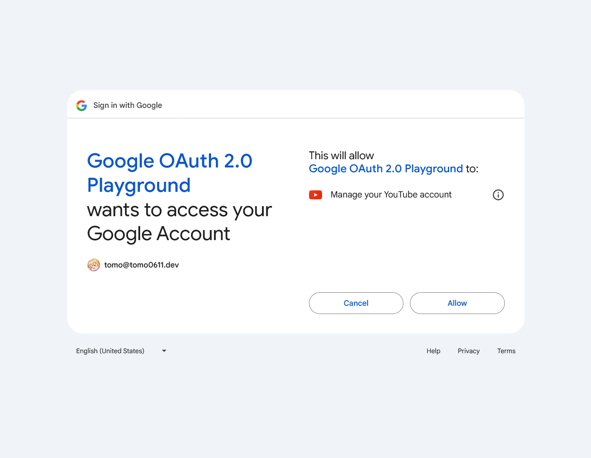
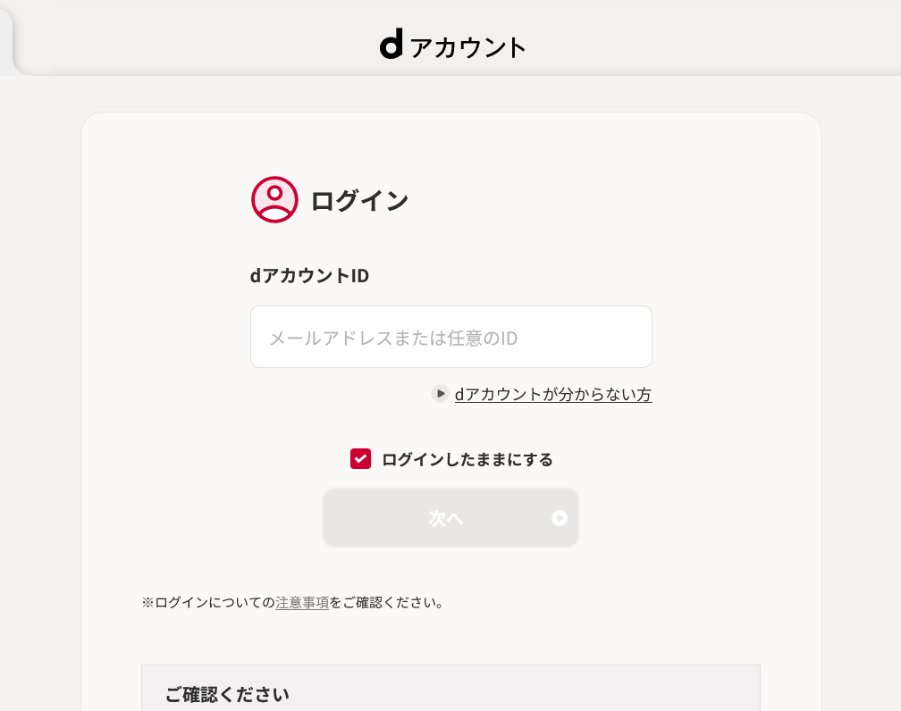
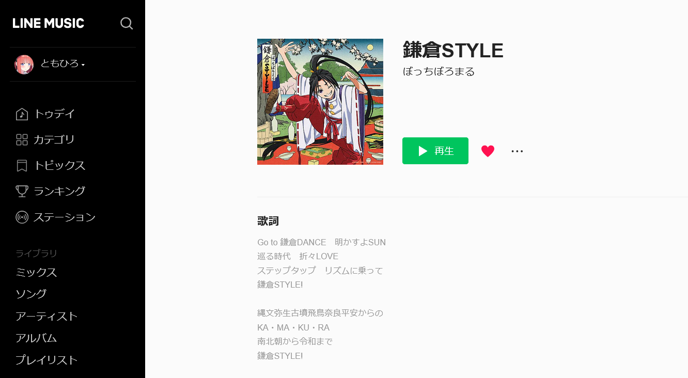
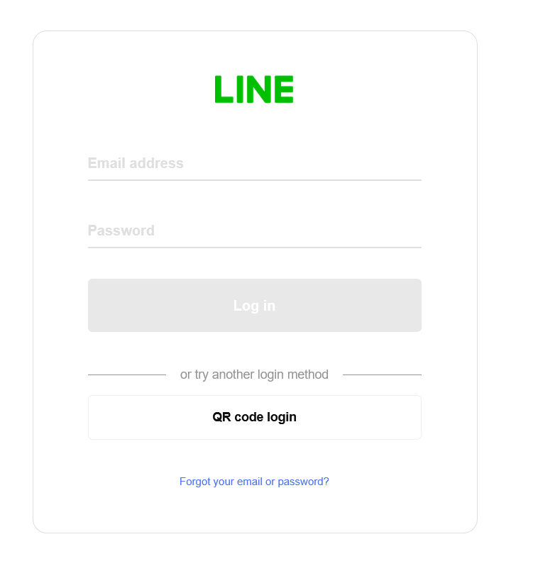

# スマートシティのためのセキュリティ<br/>～認証と認可～ (OAuth2.0とOpenID Connect)

<style scoped>
  .profile-icon {
    width: 90px;
    float: left;
    margin-right: 16px;
    margin-top: 12px;
  }
</style>


### 大井 智弘（大阪公立大学 工学部・情報工学科3年）

<br />

2025年1月11日（土） |　関西テック 交流会イベント vol.4

---

# 自己紹介


## 大井 智弘 / tomo0611.dev

- 大阪公立大学 工学部 情報工学科 3年
- 21 y.o.
- [コンピューターハウスランダム](https://ch-random.net/) 部長
- 大学の情シスでシステム開発のアルバイト
- SecHack365 '24 (NICT)に参加中
- [tomo0611.dev](https://tomo0611.dev)

---

# 自己紹介


## 好きなこと / 趣味など

- アニメ
- 物理的なサーバー(仮想化含む)、ネットワーク構築
- Webアプリ、バックエンド開発
- ネイティブアプリ(Kotlin)開発
- アプリケーション解析
---

# 目次

1. スマートシティとは
2. OAuth2.0って何？
3. 実際の通信フローを見てみる
4. Scopesについて
5. PKCEについて
6. OAuth2.0とOpenID Connectの違い
7. まとめ


---

# おことわり

- スマートシティのための云々と言ってますが、結局のところ大学の情シスのアルバイトで得た知見を話したいので話すだけです
  - いやでも、多数の端末が繋がり情報が増えると、アクセス制御って大事だよね
- スライド作成は今朝の10時半から書き始めました。やばいです。出来上がるのでしょうか
- あとパワポ脱却を目指して今回Markdownという形式で書いてます、凝ったものは作れなさそう
- なので、クオリティはご容赦ください。
---

# 1. スマートシティって何なんでしょうね？

年齢は？性別は？彼氏/彼女はいるの？

調べてみました

---

# 1. スマートシティの実現イメージ

<style>
img[alt~="center"] {
  display: block;
  margin: 0 auto;
}
</style>


---

# 1. スマートシティとは

> グローバルな諸課題や都市や地域の抱えるローカルな諸課題の解決、また新たな価値の創出を目指して、ICT 等の新技術や官民各種のデータを有効に活用した各種分野におけるマネジメント（計画、整備、管理・運営等）が行われ、社会、経済、環境の側面から、現在および将来にわたって、人々（住民、企業、訪問者）により良いサービスや生活の質を提供する都市または地域$^1$

難しいこと言ってるんで要約しましょう。

> > > 1. [政府の施策におけるスマートシティの定義 (内閣府 Society 5.0より)](https://www8.cao.go.jp/cstp/society5_0/smartcity/index.html)

---


# 1. スマートシティとは (ざっくり)

> いろんな課題を解決するために、ICT やデータを活用して、良いサービスを提供する都市や地域

データを活用か……
最近情報漏洩とかも多いし、セキュリティって大事ですよね

なので、今回はみなさんも普段使っている認証と認可について話します (ごり押し)

<sub><sup>~~まあ、実際どういう風にスマートシティに組み込むかはすごい人が考えてくれるでしょう！~~</sub></sup>

---

# 2. OAuth2.0って何？

<style scoped>
    .flex-container {
        display: flex;
        justify-content: space-around;
        align-items: center;
    }
    .flex-container img {
        max-width: 45%;
        height: auto;
    }
</style>

<div class="flex-container">
    
    
</div>

---

# 2. OAuth2.0って何？

- OAuth2.0とはGoogle, Microsoft, X (旧Twitter), Line, Docomoなどでも使われている認可(Authorization)のためのプロトコル
- 〇〇アカウントでログイン(social login)系の奴は全部これ
- 他にも API にアクセスするための認証にも使われる

> > > 【注意】OAuth2.0のimplicit grant flowを使って認証(Authentication)をしてはいけない

---

# 実際に見てみる

百聞は一見に如かず。見てみるのが早い。

---


# OAuth2.0の通信フローを見てみる

今回は、Line MusicのOAuth2.0を例に見てみましょう

<style scoped>
    .flex-container {
        display: flex;
        justify-content: space-around;
        align-items: center;
    }
    .flex-container img {
        max-width: 40%;
        height: auto;
    }
</style>

<div class="flex-container">
    
    
</div>

---

# その前に用語の整理だけ

ユーザー : ログインをしようとしている人 (ぼく)
クライアント : ログインを受け付ける側のアプリケーション (Line Music)
認可サーバー : ユーザーの認可を受け付けるサーバー (Line)

---

# OAuth2.0の通信フローを見てみる (User視点)

1. https://access.line.me/oauth2/v2.1/authorize?response_type=code&client_id=xxx&redirect_uri=yyy&state=zzz&code_challenge=aaa&code_challenge_method=S256&scope=profile
2. ログイン画面
3. 同意画面 (既に同意していればスキップ)
4. https://music.line.me/login/callback?code=bbbb&state=zzz
5. ログイン完了

---


# OAuth2.0の通信フローを見てみる (Client視点)

1. ユーザーを https://access.line.me/oauth2/v2.1/authorize?response_type~~ にリダイレクト
2. /login/callback?code=bbbb&state=zzz にアクセスが来たら、codeを取得
3. https://api.line.me/oauth2/v2.1/token (Tokenエンドポイント) に code, client_id, client_secret, redirect_uri を送信し、Access Tokenを取得
4. Authorization: Bearer {access_token} をヘッダに付与し、https://api.line.me/oauth2/v2.1/userinfo にアクセスしてユーザー情報を取得
5. ログイントークンを発行し、ログイン状態を保持させる

--- 
# Scopesについて

scope=profileというのが最初のリクエストに含まれていましたが、これは何？

これは、アクセスする情報の範囲を指定するものです。

## 何が実現できるか
例) 個のアプリに口座番号を連携したいが、口座残高までは連携したくない

これによりアクセス範囲を限定するアクセス制御が可能になります。

また、同意画面でどのような情報を取得するかをユーザーに確認させることができます。最終的にどのスコープのAccess Tokenになったかというのは、TokenエンドポイントにAccess Tokenを取りに行った時点で確認できます。

---

# Scopesについて (例)

Lineの場合は`profile openid email`の3つが指定できます。
複数指定する場合はスペース区切り(`%20`)で指定します。
例えば、profileだとユーザーのプロフィール情報を取得できるようになります。$^1$

Google Driveだと、`https://www.googleapis.com/auth/drive.file`などを指定することで情報を取得することができます。$^2$

これは元のProviderによって異なるのでドキュメント要参照です。

>>> 1. [スコープ | Line Developers](https://developers.line.biz/ja/docs/line-login/integrate-line-login/#scopes)
>>> 2. [Choose Google Drive API scopes | Google Drive](https://developers.google.com/drive/api/guides/api-specific-auth)

---

# PKCEについて

code_challenge=aaa&code_challenge_method=S256 は何なのでしょうか？

PKCE(pronounced "pixy")とは、「Proof Key for Code Exchange by OAuth Public Clients」の略称で、認可コード横取り攻撃を対策するための、OAuth2.0の拡張仕様です。

認可コード(code)を取得する際に、code_verifierを生成し、code_challengeに変換したものをリクエストに含めることで、認可コード横取り攻撃を防ぎます。

---

# PKCEについて (Go言語での実装例)

```go
import (
	"crypto/sha256"
	"encoding/base64"
)

var code_vertifier = "XXXX" // ランダムに生成する
var hash = sha256.Sum256([]byte(code_vertifier))
var code_challenge = base64.URLEncoding.WithPadding(base64.NoPadding).EncodeToString(hash[:])
```

sha256でハッシュ化したもの(`code_challenge`)を先に送り、Access Token取得時に元(`code_vertifier`)も一緒に送らないとTokenを取得できないので、攻撃者が現実時間で元の`code_vertifier`を算出するのは困難になります。

---

# Refresh Tokenについて

Access Tokenは有効期限(大体3600秒)がありますが、Refresh Tokenを使うことでAccess Tokenを再取得できます。scopeにofflineを指定すればOK
```json
{
  "access_token": "新しいAccess Token",
  "token_type": "Bearer",
  "expires_in": 3600,
  "refresh_token": "新しいRefresh Token",
  "scope": "指定されたScope"
}
```
ユーザーがアプリを使っていない間でも何かしらの処理をしたい場合につける

---

# openid-configurationについて

---

# OAuth 2.0 authorization code flow

<style scoped>
    img {
        max-width: 60%;
        height: auto;
        margin: 10px auto;
        display: block;
    }
</style>


[Microsoft identity platform and OAuth 2.0 authorization code flow](https://learn.microsoft.com/en-us/entra/identity-platform/v2-oauth2-auth-code-flow)より引用

---

# OAuth 2.0 authorization code flow

<style scoped>
    img {
        max-width: 60%;
        height: auto;
        margin: 10px auto;
        display: block;
    }
</style>


[Microsoft identity platform and OAuth 2.0 client credentials flow](https://learn.microsoft.com/en-us/entra/identity-platform/v2-oauth2-client-creds-grant-flow)より引用

---

# OAuth2.0とOpenID Connectの違い

- OAuth2.0は認可のためのプロトコル
- OpenID Connectは認証のためのプロトコル
- OpenID ConnectはOAuth2.0をベースにしている


---


# まとめ

- OAuth2.0 (OIDC) は認可プロトコルで、サイトへのログインなど様々な場所で使われている。
- スコープというアクセス範囲の指定でデータ連携をセキュアに行っている。
- PKCEという攻撃者の窃取防止の機能がある
- スマートシティでは、①データ連携基盤の普及$^1$などにおいて、アクセス制御はより一層重要になっており、個の設計の考え方を応用できるのでは？

ご清聴ありがとうございました :pray:

>>> 1. [政府の施策におけるスマートシティの定義 (内閣府 Society 5.0)のスマートシティの実現イメージの①](https://www8.cao.go.jp/cstp/society5_0/smartcity/index.html)