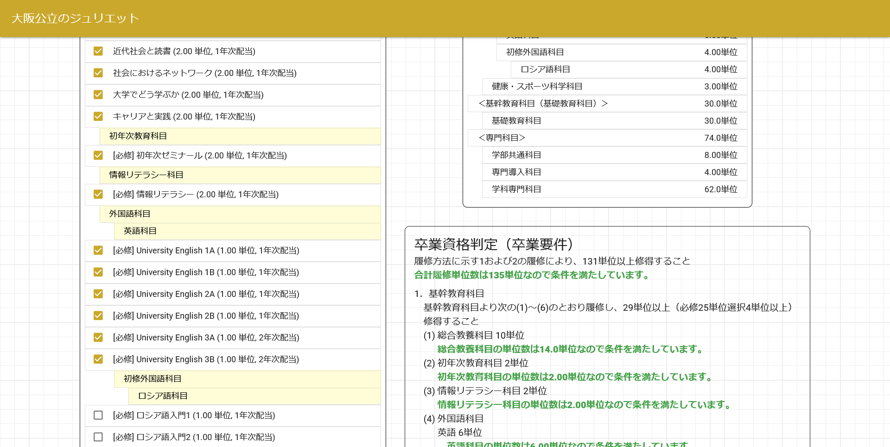

# あなたは大学を卒業できますか？<br/>～卒業判定機を作る～ (教育課程と学位)

<style scoped>
  .profile-icon {
    width: 90px;
    float: left;
    margin-right: 16px;
    margin-top: 12px;
  }
</style>


### tomo0611（大阪公立大学 工学部・情報工学科4年）

<br />

2025/5/25 (Sun) | ランダム友好祭LT

---

# 自己紹介


## tomo0611 / tomo0611.dev

- 大阪公立大学 工学部 情報工学科 4年
- 21 y.o.
- [コンピューターハウスランダム](https://ch-random.net/) 前部長
- 大学の情シス(情報基盤課)でアルバイト
- 情報基盤センター長(阿多先生)の研究室所属
- SecHack365の社会実装ゼミ 優秀修了

---

# 自己紹介


## 好きなこと / 趣味など

- ソフトウェア要件、プロジェクト開発
- サーバー、ネットワーク構築
- ネイティブアプリ(Kotlin)開発
- アプリケーション解析
- アニメ


---

# 目次

1. 今回作成した判定サイトを見る
2. 教育課程(カリキュラム)って何？
3. 科目と授業、履修と成績
4. 同じ教室、同じ時間、同じ課題。でも違う単位数
5. 科目の体系 (科目分類)
6. 科目が配当されている
7. 卒業要件
8. まとめ


---

# おことわり

- 大学公式のものではありません。


---

# 1. 今回作成した判定サイト


## 機能

- 2022年の工学部情報工学科の教育課程に基づいて、卒業可能かどうかを判定するサイト
- 科目分類ごとの修得単位数を確認できる


---

# 1. 今回作成した判定サイト




---

# 2. 教育課程(カリキュラム)って何？

> 文部科学省では、平成19年に大学設置基準（昭和31年文部省令第28号）を改正し、大学は、学部や学科等ごとに、人材の養成に関する目的等を学則等で定めることとしましたが、具体的な大学の教育課程については、(中略)、これ以外は各大学が自由にカリキュラム編成をすることができるようになっています。$^1$

要するに、学部や学科等ごとに教育課程(カリキュラム)を定めることができるってことです。卒業するには～単位以上必要でだったり、この科目の単位を取らないといけなかったりします。

> > > 1. [大学のカリキュラムなどの教育内容はどのような考え方で決められるのですか (文部科学省 高等教育局)](https://www.mext.go.jp/a_menu/koutou/daigaku/04052801/001.htm)

---

# 3. 科目と授業、履修と成績

科目と授業の関係を先に説明します。


<div class="mermaid">
graph TD
    A[University English 2A] --> B[UE 2A /獣1_森]
    A --> C[UE 2A /工<情報>2_森]
    A --> D[UE 2A /理<数学>1_森]
</div>

<script type="module">
import mermaid from 'https://cdn.jsdelivr.net/npm/mermaid@11.6.0/dist/mermaid.esm.min.mjs';
mermaid.initialize({ startOnLoad: true });
window.addEventListener('vscode.markdown.updateContent', function() { mermaid.init() });
</script>

授業名が違っても、どれもUniversity English 2Aなので、6割以上の評定を取れると同じ科目を習得できます。大学側の都合でクラスを分けているだけで、本質的には全て同じなのでどのクラスで履修してもUniversity English 2Aが修得できます。

<sub><sup>~~現実問題クラスごとの差はあるのですが、本来は同じ課題,基準,成績分布になるはずです~~</sub></sup>

---

# 3. 科目と授業、履修と成績

<style scoped>
  .mermaid .node text {
    white-space: normal; /* テキストの折り返しを許可 */
    overflow: visible; /* はみ出しを許容（通常は不要） */
  }
</style>

先ほどとは逆に複数の科目を持つ授業もあります。

<div class="mermaid">
graph BT
    A[健スポ科学実習 /工<情報>N] --> B[<公大> 健スポ科学実習]
    A --> C[<府大> 健スポ科学演習I]
</div>

<script type="module">
import mermaid from 'https://cdn.jsdelivr.net/npm/mermaid@11.6.0/dist/mermaid.esm.min.mjs';
mermaid.initialize({ startOnLoad: true });
window.addEventListener('vscode.markdown.updateContent', function() { mermaid.init() });
</script>

このような授業は「まとめ授業」と呼ばれます。
各大学ごとに教育課程を設置するので、本学では府大・市大の科目が含まれていることが多くあります。

---

# 3. 科目と授業、履修と成績

今までのことを踏まえると、
- 履修することができるのは授業
- 授業で特定(6割)以上の成績を取ると科目を修得できる
- 単位認定を除き、科目に直接作用することができない。(あくまで科目は仮想世界上のもので、現実世界の授業に紐づいている)

---

# 4. 同じ教室、同じ時間、同じ課題。でも違う単位数

語学や体育などの科目が府大生は2単位だったのに、公大生は1単位だったり、同じ授業を受けているのに単位数が違うことがあります。
先ほどまでの話を理解できていれば説明ができます（意味分からんけど）

- 府大生は大阪府立大学の各学部・学域が定めた教育課程に基づいて、2単位の授業を受けている。
- 公大生は大阪公立大学の各学部・学科が定めた教育課程に基づいて、1単位の授業を受けている。

→同じ教室、同じ時間を受けていても、そもそもどの科目として受けているかが違うので授業名だけでなく単位数や配当年次が違う。

---

# 5. 科目の体系 (科目分類)
科目は「科目分類」という体系に分けられています。
<div class="mermaid">
graph TD
    A[基幹教育科目（基礎教育科目除く）] --> B[総合教養科目]
    A --> C[初年次教育科目]
    A --> D[情報リテラシー科目]
    A --> E[外国語科目]
    E --> F[英語科目]
    E --> G[初修外国語科目]
    G --> H[中国語科目]
    G --> I[韓国語科目]
    G --> J[フランス語科目]
    G --> K[ドイツ語科目]
    G --> L[ロシア語科目]
    A --> M[健康・スポーツ科学科目]
</div>
<script type="module">
import mermaid from 'https://cdn.jsdelivr.net/npm/mermaid@11.6.0/dist/mermaid.esm.min.mjs'; 
mermaid.initialize({ startOnLoad: true });
window.addEventListener('vscode.markdown.updateContent', function() { mermaid.init() });
</script>

---

# 6. 科目が配当されている
科目は配当年次や必修かどうかが決まっており、どの年次に履修することができるかが決まっています。

| 科目分類 | 科目名 | 単位数 | 必修フラグ | 配当年次 |
| --- | --- | --- | --- | --- |
| 基礎教育科目 | 応用物理学実験 | 2.00 | 必修 | 2年次 |
| 基礎教育科目 | 基礎量子力学B | 2.00 | なし | 2年次 |
| 学科専門科目 | 情報工学卒業研究A | 3.00 | 必修 | 4年次 |
| 学科専門科目 | 情報工学特殊講義 | 2.00 | なし | 4年次 |

---

# 7. 卒業要件

```
1．基幹教育科目
別紙、基幹教育科目より次の(1)～(6)のとおり履修し、29単位以上（必修25単位選択4単位以上）修得すること
 (1)総合教養科目 10単位,(2)初年次教育科目 2単位
 (3)情報リテラシー科目 2単位
 (4)外国語科目
  英語 6単位
  初修外国語 2単位
 (5)健康・スポーツ科学科目 3単位, (6)(1)～(5)で履修した科目以外から4単位を修得すること
 (7)基礎教育科目 30単位（必修20単位 選択10単位）
2．専門科目
上記1(7)に加え、次の(1)～(3)のとおり履修し、合計102単位以上修得すること
 (1)学部共通科目 2単位以上（必修2単位）,(2)専門導入科目 4単位（必修4単位）
 (3)学科専門科目 18単位以上（必修18単位）
 (1)～(3)で72単位以上を修得すること
```

---

# 8. まとめ
- 教育課程(カリキュラム)は学部や学科ごとに定められ、卒業に必要な単位数や科目が決まっている。
- 授業を履修し、成績をとることで科目が修得(授与)される。
- 同じ授業でも、学部や学科によって単位数が異なることがある。
- 科目は「科目分類」という体系に分けられ、配当年次や必修か否かが設定されている。

ご清聴ありがとうございました :pray:

